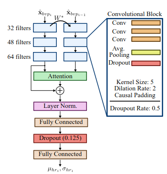

# Laporan Proyek 

**Intern Name:** Tirta Aji Nugraha   
**Topic:** ARM AI Wearable - HR (Heart Rate)   
**Supervisor:** Muhammad Faudzan Abdullah  
**Draft Status:** Draft  
**Target Hardware:** Grove Vision AI V2 (Cortex-M55 + Ethos-U55)

---

## 1. Overview

Proyek ini bertujuan untuk mengimplementasikan model machine learning KID-PPG untuk mengestimasi detak jantung berdasarkan sinyal Photoplethysmography (PPG). Sensor yang digunakan adalah sensor PPG Max30102, dan model ini ditargetkan untuk berjalan pada perangkat keras Grove Vision AI V2 yang menggunakan arsitektur Cortex-M55 dan Ethos-U55.

## 2. Background
Pemantauan heart rate secara kontinu dan non-invasif merupakan kebutuhan penting dalam aplikasi kesehatan wearable. Sensor PPG menjadi pilihan utama karena sifatnya yang non-invasif, murah, dan mudah diintegrasikan ke perangkat wearable. Tantangan utama dalam estimasi HR dari sinyal PPG adalah motion artifact (MA), yaitu noise yang dihasilkan oleh gerakan tubuh yang frekuensinya dapat overlap dengan frekuensi HR target (0.5-4 Hz). Dalam literatur, metrik evaluasi standar untuk task ini adalah Mean Absolute Error (MAE) dalam satuan BPM, dengan benchmark pada dataset PPG-DaLiA. Model state-of-the-art yang di-deploy di MCU seperti Q-PPG mencapai MAE 4.41 BPM dengan footprint 412 kB, sementara EnhancePPG mencapai MAE 3.54 BPM pada Cortex-M7. KID-PPG dipilih karena mencapai MAE 2.85 BPM pada PPG-DaLiA, terbaik di antara model reprodusibel yang tersedia secara publik, sekaligus memiliki arsitektur yang cukup ringan untuk dikompres ke target edge device.

## 3. Dataset & Preprocessing
### 3.1 Dataset
Model KID-PPG dibangun di atas dataset publik bernama PPG-Dalia. Dataset ini dipilih karena sangat merepresentasikan kondisi noisy dari perekaman wearable device di dunia nyata.
* **Subjek & Ukuran:** Melibatkan data dari 15 subjek berbeda yang melakukan berbagai aktivitas dinamis sehari-hari (seperti duduk, berjalan, bersepeda). Sinyal yang diambil biasanya berupa data PPG optik dan akselerometer 3-sumbu (3D).
* **Label Target:** Jaringan saraf dilatih untuk memprediksi detak jantung aktual dalam satuan Beats Per Minute (BPM) secara terus-menerus.
* **Strategi Evaluasi (Split):** Pelatihan memisahkan data berbasis subjek menggunakan metode Leave-One-Subject-Out (LOSO) atau Leave-One-Group-Out (LOGO). Model dilatih pada 14 subjek, lalu diuji pada 1 subjek sisanya agar benar-benar merepresentasikan kemampuan model terhadap data baru yang belum pernah dilihat.

### 3.2 Preprocessing
Preprocessing data untuk model KID-PPG dilakukan dalam dua tahap, yaitu tahap training dan tahap inferensi.
#### a. Tahap Training
* **Adaptive Filtering:** sebuah model filter linier dilatih berulang-ulang secara spesifik hingga 16.000 epoch sebelum proses training utama dimulai. Filter ini menggunakan manipulasi Fast Fourier Transform (FFT) untuk menganalisis spektrum frekuensi dan mengurangkan pola artefak pergerakan dari sinyal PPG mentah.
* **Augmentasi Data:** Untuk mencegah class imbalance di mana sebagian besar dataset merepresentasikan detak jantung saat rileks/duduk, terdapat tahap injeksi data sintetis dan probabilistic augmentation serta pembuatan sampel detak jantung tinggi.

#### b. Tahap Inferensi
* **Downsampling:**
* **Z-Score Normalization:** Setiap segmen aktivitas diseragamkan magnitudonya dengan teknik Z-score. Proses ini mencabut rentang dinamik sinyal optik yang ekstrem dengan mengurangi nilai rata-rata dan membaginya dengan standar deviasi.
* **Buffering:**

## 4. Model

  

**Parameters Count:** ~112K Parameters

**Input Shape:** [N, 256, 2]

**Training Configuration:**
* **Optimizer:** Menggunakan Adam Optimizer, yang merupakan standar paling optimal dan stabil untuk mengarahkan konvergensi bobot pada arsitektur yang menggunakan attention mechanism.
* **Loss Function:** Untuk model utamanya (versi probabilistik), fungsi objektif yang digunakan adalah Negative Log-Likelihood (NLL). Model ini tidak memprediksi nilai mutlak dari detak jantung, melainkan memprediksi parameter distribusi (rata-rata/ mean dan standar deviasi) untuk memberikan estimasi sekaligus tingkat ketidakpastiannya.
* **Epochs:** Terdapat dua fase iterasi dalam repositori ini:
    * Fase Preprocessing: Filter adaptif dilatih dalam iterasi yang sangat masif, yakni hingga 16.000 epoch.
    * Fase Training Utama: Pelatihan model deep learning-nya ditetapkan maksimal hingga 500 epoch per subjek (menggunakan metode Cross-Validation LOSO).
* **Batch Size:** Ditetapkan secara eksplisit sebesar 128 atau 256 sampel dalam setiap iterasi pembaruan bobot, memberikan keseimbangan yang baik antara pemanfaatan memori GPU dan kehalusan gradien.

**Metode Optimasi:**
* **Pruning:** proses menghapus neuron, bobot (weights), atau koneksi dalam jaringan saraf tiruan (neural network) yang dianggap kurang penting atau tidak berkontribusi banyak pada hasil prediksi model. Selective pruning dengan PolynomialDecay (sparsity 10%→50%) hanya pada layer Conv1D dan Dense; MultiHeadAttention tidak di-prune karena ketidakkompatibilan tensorflow_model_optimization (TFMOT).
* **Quantization Aware Training (QAT):** Proses mengubah format data dari floating-point (misalnya FP32) ke integer yang lebih rendah (misalnya INT8). Dalam metode QAT, proses kuantisasi disimulasikan langsung selama fase pelatihan atau fine-tuning model menggunakan dataset lengkap. Dengan cara ini, model dapat beradaptasi dengan kesalahan (error) akibat pemotongan bit data sejak awal, sehingga model mampu menyesuaikan bobotnya agar akurasi akhir tetap terjaga mendekati model aslinya. Pada model KID-PPG dilakukan QAT dengan quantize_annotate + quantize_apply secara selektif (layer Conv1D dan Dense), partial quantization pada layer attention.

## 5. Results

| Stage | MAE (BPM) | Catatan |
| :--- | :--- | :--- |
| KID-PPG Original | 2.8 | Evaluasi via model_h5.predict() pada PPG-DaLiA |
| After Pruning | 5.7 | Fine-tune 20 epoch pada mixed dataset |
| After QAT | 5.3 | Fine-tune 10 epoch, partial quantization |

Model baseline KID-PPG mencapai MAE 2.8 BPM, konsisten dengan hasil yang dilaporkan pada paper aslinya (2.85 BPM pada PPG-DaLiA). Setelah pruning dengan target sparsity 50% pada layer Conv1D dan Dense, MAE meningkat menjadi 5.7 BPM, degradasi sebesar 2.89 BPM. Degradasi ini dapat terjadi karena berkurangnya kapasitas representasi model akibat pemangkasan bobot, khususnya pada layer konvolusi yang berperan dalam ekstraksi fitur morfologi sinyal PPG.
Penerapan QAT setelah pruning berhasil memulihkan sebagian akurasi, menurunkan MAE dari 5.7 menjadi 5.3 BPM. Perbaikan ini terjadi karena QAT memungkinkan model menyesuaikan bobotnya terhadap noise quantization INT8 selama fine-tuning, sehingga error akibat diskretisasi bobot dapat diminimalkan.

## 6. Deployment
### 6.1 Standard Metric Summary
| Sensor | Model | Arch | Input Shape | Params | MAC | SRAM |Accuracy Metric | Cycles Total | Quantization |
| :--- | :--- | :--- | :--- | :--- | :--- | :--- | :--- | :--- | :---|
| Max30102 | KID-PPG (Pruned + QAT) | 1D-CNN 3 block + Attention | [1, 256, 2] | ~112K | 13,450,768 MAC | 26.91 KiB | MAE: 5.3 BPM | 629117 | INT8 |

### 6.2 Deployment Notes
* **a. Metode Quantization:** Quantization-Aware Training (QAT) diterapkan setelah pruning menggunakan tensorflow model optimization (TFMOT). Pruning dilakukan secara selektif hanya pada layer Conv1D dan Dense untuk menghindari inkompatibilitas dengan MultiHeadAttention. QAT juga diterapkan secara selektif (partial quantization) dengan alasan yang sama.
* **b. Toolchain:** TensorFlow Lite Converter dengan TFLITE BUILTINS INT8+ TFLITE BUILTINS sebagai fallback. Verifikasi operator NPU menggunakan Arm Vela compiler.
* **c. Input shape:** Diubah dari dinamis (None) menjadi statis ([1, 256, 2]) dengan cara membungkus QAT model dalam tf.keras. Model baru yang memiliki tf. keras. Input dengan batch_size=1 eksplisit, sebelum konversi TFLite. Ini memungkinkan Vela compiler mengoptimalkan memory layout secara penuh.

## 7. Conclusion + Challenges
Implementasi model KID-PPG pada perangkat Grove Vision AI V2 (Cortex-M55 + Ethos-U55) berhasil dilakukan, membuktikan kelayakan arsitektur berbasis *attention* untuk dijalankan pada *edge device* dengan memori terbatas. Meskipun model asli memiliki performa yang sangat baik dengan MAE 2.8 BPM, kompromi antara akurasi dan konstrain *hardware* tidak dapat dihindari. Proses optimasi melalui *Pruning* (50% sparsity) dan *Quantization-Aware Training* (QAT) INT8 menghasilkan peningkatan efisiensi yang signifikan (SRAM 26.91 KiB), namun berdampak pada penurunan akurasi menjadi MAE 5.3 BPM. Keberhasilan kompilasi model sangat bergantung pada penyesuaian *input shape* dari dinamis menjadi statis `[1, 256, 2]`, yang memungkinkan *compiler* Arm Vela mengoptimalkan alokasi memori NPU secara penuh.

Tantangan terbesar dalam *deployment* ini adalah inkompatibilitas layer `MultiHeadAttention` dengan *library* TensorFlow Model Optimization (TFMOT). Hal ini memaksa penerapan optimasi *pruning* dan QAT hanya dapat dilakukan secara parsial pada layer `Conv1D` dan `Dense`, membatasi potensi kompresi maksimal. Berdasarkan perspektif desain *hardware* dan sirkuit digital, mengadopsi model *deep learning* yang kompleks ke dalam NPU memerlukan penyesuaian arsitektural sejak fase desain awal. Untuk pengembangan selanjutnya, direkomendasikan untuk merancang ulang mekanisme *attention* menggunakan operasi matematika dasar yang didukung penuh oleh akselerator *hardware* atau mengeksplorasi *custom operator* untuk Ethos-U55 guna menyeimbangkan efisiensi komputasi tanpa mengorbankan akurasi secara drastis.

